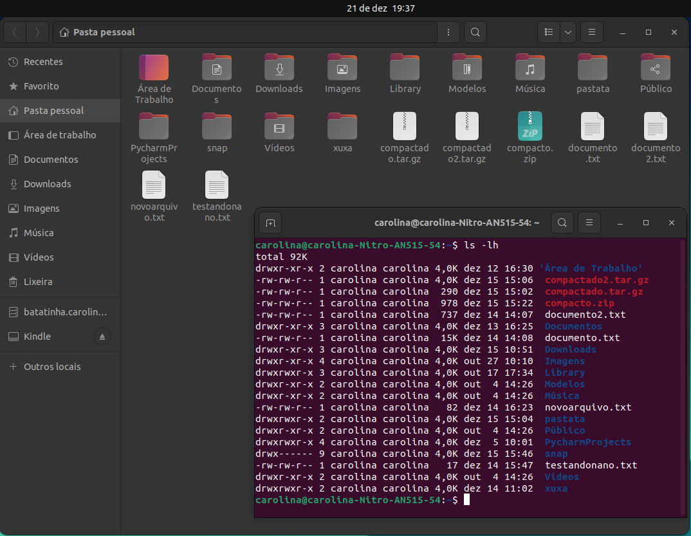
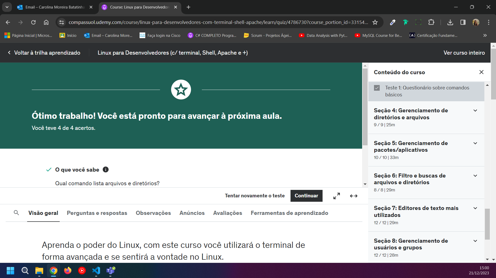
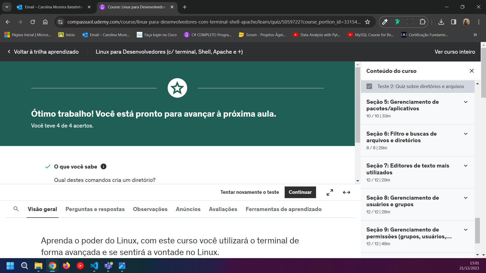
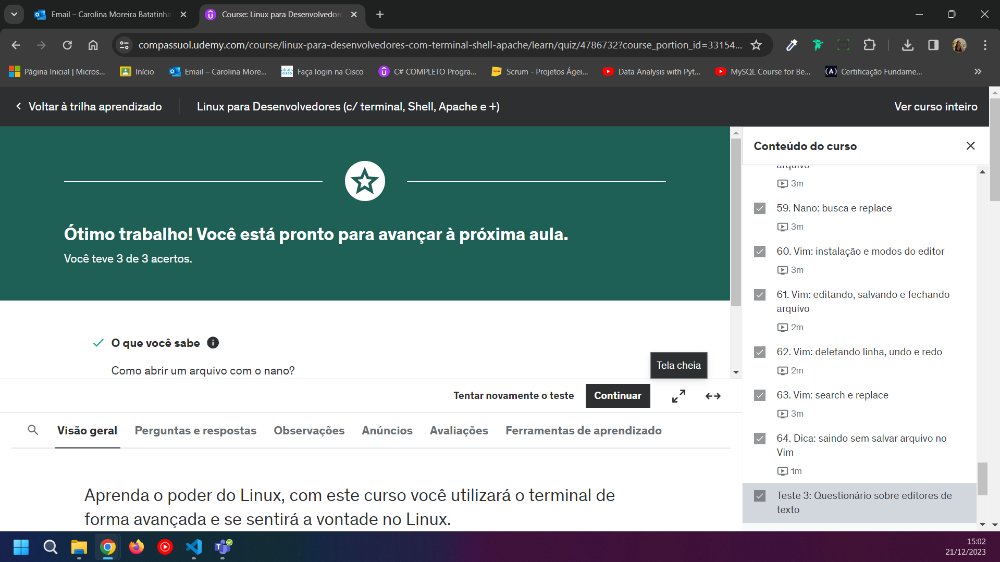
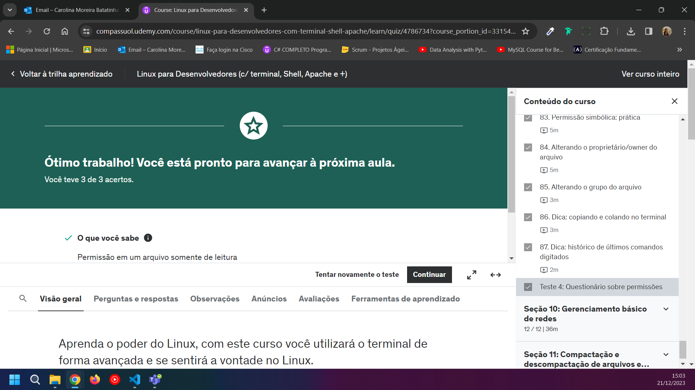
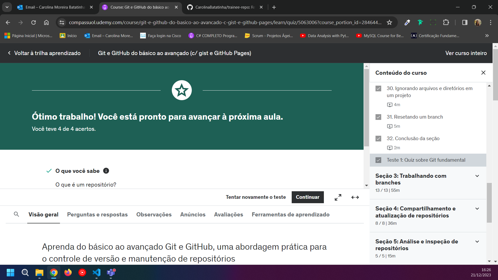
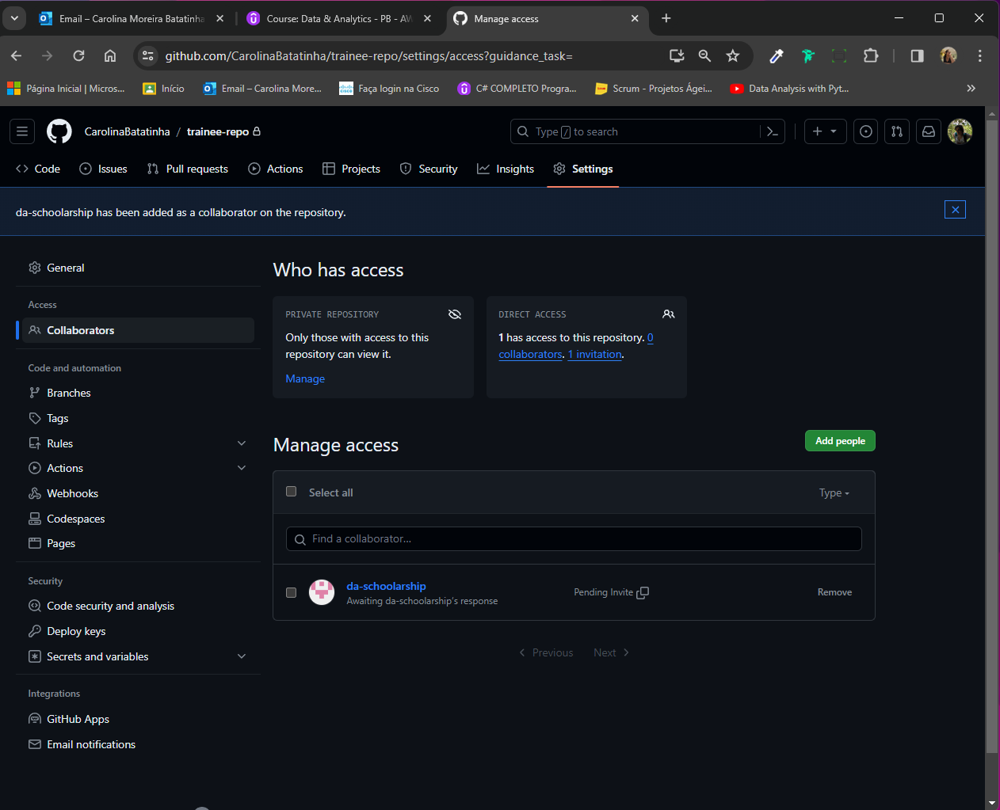

# Relatório
A primeira sprint foi composta por dois cursos obrigatórios entitulados **Linux para Desenvolvedores (c/ terminal, Shell, Apache e +)** e **Git e GitHub do básico ao avançado (c/ gist e GitHub Pages)**. Apesar de não ter experiências profissionais na área, eu tive contato prévio com o Linux e com o Git e GitHub através de alguns bootcamps que participei. Os relatos a seguir dizem respeito ao meu aprendizado e minhas anotações durante essa primeira jornada.

### Linux
O **Linux** é um sistema operacional de código aberto, cujas características mais reconhecidas são a segurança e o uso constante do seu terminal para a execução de seus comandos.

*Mesmo o **Linux** instalado na minha máquina pessoal num dual boot, instalei a máquina virtual e fiz as primeiras aulas usando Oracle VM Machine para consolidar os conhecimentos com virtualização, mas, posteriormente, dei continuidade ao meu aprendizado dentro do próprio Ubuntu.*

Segue abaixo lista dos comandos mais comumente usados e suas funções:
* **cd**: muda de diretório. Tem como opções a possibilidade de mudar de uma pasta para outra e suas variações (como ir um diretório acima ou abaixo, além de mover para a home);  
  
* **ls**: lista arquivos e diretórios, bem como também pode mostrar seus arquivos ocultos, a última data de modificação e o tamanho dos arquivos;
  
*  **clear**: limpa a tela do terminal;
*  **cat**: exibe o conteúdo de um arquivo, mas também exibe múltiplos arquivos de uma vez, mostra seu número de linhas e cria um arquivo através de outro;
*  **touch**: cria um ou vários arquivos. Este comando também muda sua data de acesso;
*  **man**: é o próprio manual do sistema operacional. Utiliza-se escrevendo inicialmente o comando **man** seguido do argumento (**ls**, por exemplo);
* **mkdir**: cria diretórios;
* **rm**: deleta arquivos e diretórios;
* **cp**: copia arquivos para o próprio diretório, ou outro diretório;
* **mv**: fazendo uma analogia ao sistema **Windows**, esse comando recorta o arquivo e o envia a outro diretório, ou simplesmente o renomeia.

Para atualizar o sistema e os repositórios, sem que haja a instalação dos mesmos, usa-se o comando:
```
sudo apt-get update
```
A atualização dos pacotes se dá com o comando:
```
sudo apt-get upgrade
```

O comando **sudo apt-get autoremove** remove os pacotes não utilizados.

Para a leitura do início de um arquivo, são normalmente usados os comandos **head** seguidos do nome do arquivo pesquisado; o comando **tail** permite a leitura do final do documento.

Os editores de texto mais comumente conhecidos no Linux são o **Nano** e o **Vim**.

O gerenciamento de usuários e grupos é realizado a partir do uso dos comandos:
* **adduser**: cria um usuário;
* **userdel --remove**: remove usuários;
* **usermod**: habilitam e desabilitam um usuário.
Ainda dentro das possibilidades do gerenciamento de usuários e grupos, é possível mudar ou remover o usuário de um grupo, bem como gerenciar **permissões** de escrita, leitura e execução.

Com o uso do comando "**tar -czvf nome_do_arquivo.tar.gz /<diretório>**" se pode compactar arquivos no formato .tar, direncionando-os para diretórios específicos. Pode ser descompactado com o uso do comando "**tar -xzvf nome_do_arquivo.tar.gz**"..
Ao escolher pelo formato .zip, usa-se o comando **"zip -r nome_do_arquivo.zip diretório_ou_arquivo"**. Sua descompactação se dá com o uso de "**unzip nome_do_arquivo.zip -d destino**".


Demonstração da criação de diretórios e execução de comandos ao final do curso de *Linux para Desenvolvedores*.



### Git e GitHub

#### Git

O **Git** é um sistema de versionamento usado para rastrear mudanças em arquivos durante o desenvolvimento de um projeto de software.

*As seções 1 e 2 do curso de **Git e GitHub** (que tratam da instalação do Git e seus comandos fundamentais) trazem informações com as quais eu já possuia familiaridade.*

Em relação às **branches**, a criação, visualização e exclusão de branches são realizadas com os comandos:
```
git branch
git branch <nome-da-branch>
git branch -d <nome-da-branch>
```
As mudanças de um **branch** para outro ocorrem com o uso do comando (*que também permite a criação de uma nova branch*):
```
git checkout -b <nome-da-branch>
```
É importante lembrar que se faz necessário "*commitar*" todas as alterações anter de mudar de branch.

Os comandos de **merge** une códigos de dois branches:
```
git merge <nome-da-branch>
```
A ferramenta do **stash** possibilita salvar o andamento de um arquivo e assim, permite outras soluções, sem perder o código anterior. Além desso salvamento, o comando também  apaga e lista esses "*arquivos salvos*".

Os comandos de **tag** permitem a criação de checkpoints em uma branch.   
O **git fetch** atualiza branches e tags que não foram reconhecidos.

O recebimento das atualizações do repositório se dá pelo uso do comando:
```
git pull  
```  
Suas alterações são enviadas pelo:
```
git push
```  
Para exibir informações necessárias, temos à disposição do comando **git show**, que mostra informações do branch atual e todos os seus commits. As diferenças de uma nranch são mostradas com o comando:
```
git diff <arquivo1> <arquivo2>
```  
O **git shortlog** apresenta um log resumido.

A limpeza de arquivos que não foram trackeados pode acontecer usando um dos comandos:
```
git clean
git gc
```
A integridade do arquivo é é checada através do **git fsck**, conferindo se há arquivos corrompidos e sua conectividade.  

#### GitHub

O **GitHub** oferece a hospedagem de códigos-fonte e arquivos, proporcionando assim um controle das versões de projetos. A aba **Code** dá acesso ao *README.md*, ao código-fonte em si e alguns detalhes do projeto. A aba **Issue** dá a possibilidade de criar tarefas ou de avisar sobre bugs, correções ou implementos no projeto em si. O **Pull Request** dá a oportunidade do envio de códigos para a resolução de bugs pelos colaboradores, sendo previamente analisado antes de sua implementação. A **Actions** cria automatização de deploys, e normalmente é usada pelos *DevOps*. Na aba **Projects** permite a criação de projetos, fazendo uso de quadros de tarefas. A aba **Wiki** permite a criação de descrição mais profunda do projeto. **Insights** mostra as estatísticas e informações detalhadas do projeto, contribuindo com um relatório da evolução do projeto desde o início. A **Settings** mostra vários configurações do projeto (incluindo a sua remoção).

**Gists**, por sua vez, são pequenos pedaços de código, notas ou scripts que são salvos também no **GitHub**. É uma maneira rápida e fácil de compartilhar e colaborar em código sem a necessidade de criar um repositório completo.

O **Markdown** é uma linguagem de marcação simples comumente utilizada para a construção de arquivos *README*. As particularidades sobre sua escrita estão bem descritas no 
[link](https://experienceleague.adobe.com/docs/contributor/contributor-guide/writing-essentials/markdown.html?lang=pt-BR). 

*Todos os códigos praticados por mim ao longo do curso de **Git e GitHub** foram armazenados nos repositórios linkados abaixo*:
* [curso_git_1](https://github.com/CarolinaBatatinha/curso_git_1)
* [submodulo](https://github.com/CarolinaBatatinha/submodulo)
* [ecommerce_empresa_x](https://github.com/CarolinaBatatinha/ecommerce_empresa_x)
* [lembretes_markdown](https://github.com/CarolinaBatatinha/lembretes_markdown)  

# Exercícios  

Sem exercícios dentro da sprint.

# Evidências

* Primeiro teste do curso de Linux  
  

* Segundo teste do curso de Linux
  

* Terceiro teste do curso de Linux


* Quarto teste do curso de Linux


* Primeiro teste do curso de Git/ GitHub 


# Certificados
* Linux para Desenvolvedores (c/ terminal, Shell, Apache e +).jpg)


* Git e GitHub do básico ao avançado (c/ gist e GitHub Pages).jpg)


* Data & Analytics - PB - AWS 1/10


* Print da adição de colaborador no meu repositório no GitHub 