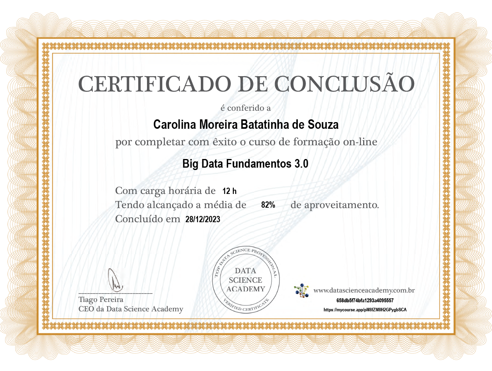
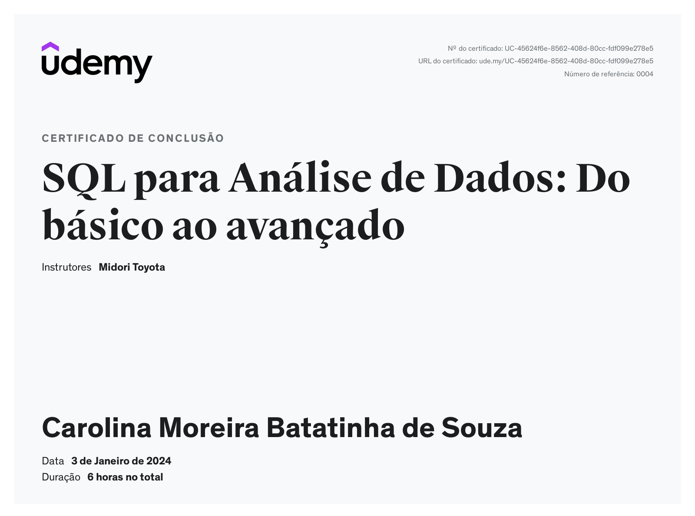

# Relatório da Sprint 2
A segunda sprint nos introduziu aos fundamentos de **Big Data** e às **noções de SQL** dentro do universo de **Análise de Dados**.

## Fundamentos de Big Data

### Conceitos Iniciais de Big Data
O **Big Data** é tido como uma gigantesca e complexa massa de dados que não podem ser processada por bancos de dados ou por aplicações de processamento tradicionais. Assim sendo, devemos ter conhecimento sobre os 4 conceitos centrais de análise de grande massa de dados:
* **volume** (*trata especificamente do tamanho e quantidade de dados gerados*);
* **velocidade** (*quanto menor o tempo entre capturar os dados e transformá-los, melhor é*);
* **variedade** (*diz respeito às muitas fontes de dados que podem ser analisadas e transformadas em informação*);
* **veracidade** (*trata especificamente se os dados coletados são verdadeiramente reais*).

Os conceitos de **Big Data** e **Ciência de Dados** não representam a mesma coisa. Enquanto que **Big Data** diz respeito a dados, a **Ciência de Dados** é definida como um conjunto de técnicas voltadas para a análise de dados.
É importante salientar que, ao aplicar a Ciência de Dados ao Big Data, o valor é estimado e assim surge a análise de grandes volumes de dados, ou seja, **Big Data Analytics** (*cuja aplicação resulta na extração, armazenamento, processamento e análise dos dados coletados com o intuito de detectar padrões*).

O volume de dados pode representar um dos maiores impactos em termos de custo, tendo que lidar com os meios de armazenamento de grandes conjuntos de dados, o acesso desses dados armazenados e a avaliação se o estoque das informações se faz realmente necessário.

O armazenamento de **Big Data** pode ser feito baseado na seguinte regra: se os dados são (ou podem ser) estruturados antes do armazenamento, é utilizado um *data warehouse*; caso os dados não sejam (*ou não possam ser*) estruturados antes do armazenamento, utiliza-se um *data lake* ou um *data store*, num sistema híbrido de armazenamento.

**Bancos de dados relacionais** são bancos de dados estruturados e com organização dos dados (*schema*) bem definida. O *schema* é definido e criado antes do armazenamento dos dados. Em um banco de dados relacional, os dados são organizados em tabelas que se relacionam.

**Bancos de dados não relacionais** admitem quem os dados podem ser parcialmente ou não estruturados, e que os dados podem trazer outros tipos de relacionamentos entre eles.

**Data Warehouse (DW)** é um sistema de armazenamento que conecta e harmoniza grandes quantidades de dados oriundos de diversas fontes. Seu objetivo é alimentar a inteligência de negócios (*Business Inteligence, ou BI*), relatórios e análises, e oferecer suporte aos requisitos de negócio. Dentre seus benefícios estão listados: 
* melhor análise de negócios;
* consultas mais rápidas;
* melhoria da qualidade dos dados;
* visão histórica (*a partir de tendências e desafios passados*).

**Data Lakes** são repositórios centralizados que permitem armazenar todos os dados estruturados e não estruturados em qualquer escala. Esses dados podem ser armazenados como estão na fonte, sem ter que primeiro estruturá-los e executar diferentes tipos de análises. O principal desafio  de uma arquitetura de Data Lake é que os dados brutos são armazenados sem a supervisão do seu conteúdo. Seus benefícios estão listados abaixo:
* armazenamento em formato bruto;
* importação de qalquer quantidade de dados em tempo real;
* repositório central para todos os dados da empresa;
* dispensa a necessidade de movimentação dos dados.

*É POSSÍVEL IMPORTAR DADOS DO DATA WAREHOUSE PARA O DATA LAKE E VICE-VERSA, DEPENDENDO DAS NECESSIDADES DE NEGÓCIO DA EMPRESA.*

**Data Stores** são repositórios para armazenar e gerenciar de maneira persistente coleções de dados que incluem tipos de armazenamento variados (*como daocumentos, filas de mensagens e outros formatos de arquivos*), não se limitando a apenas dados estruturados. É voltado para a aplicação final, não é um armazenamento genérico ou em 
massa. Benefícios:
* armazenamento de variados tipos de dados;
* flexibilidade; 
* suporte a dados semi-estruturados;
* custo total menor.

Usando os **sistemas híbridos de armazenamento**, os dados podem ser guardados em diferentes tipos de repositórios, locais ou na nuvem.

### Armazenamento e Processamento Paralelo
**Cluster de computadores** podem ser definidos como conjunto de servidores com um mesmo propósito e buscando fornecer um determinado tipo de serviço, como armazenamento ou processamento de dados, aumentando consideravelmente a capacidade computacional.

O **Armazenamento paralelo** consiste em distribuir o armazenamento de dados através de diversos servidores, aumentando de maneira considerável a capacidade de armazenamento a partir do uso de hardware de baixo custo. O gerenciamento de armazenamento paralelo se dá através de diversos computadores, mas necessitando de um sistema de arquivos distribuído. Uma possível solução para gerenciar o armazenamento distribuído em um cluster é a utilização do **Apache Hadoop HDFS** (*software open source desenvolvido já na era do Big Data*). O **HDFS** é o software responsável pela gestão do cluster de computadores e que define como os arquivos serão distribuídos através do cluster. Com o HDFS é possível criar um Data Lake que rode sobre um cluster de computadores e permite o armazenamento de grandes volumes de dados com hardware de baixo custo (*também conhecido como commodity*).

O objetivo do **processamento paralelo** é dividir uma tarefa em várias subtarefas e executá-ças simultaneamente. Dois exemplos de framework para esse propósito são o **Apache Hadoop MapReduce** e o **Apache Spark**. Ao usar um desses frameworks de **processamento paralelo**, as subtarefas são encaminhadas ao processador da máquina do cluster onde os dados estão armazenados, aumentando a velocidade de processamento destes grandes volumes de dados.

### Computação em Nuvem (Cloud Computing)

A **computação em nuvem** pode ser explicada como a entrega de serviços de computação (como servidores, armazenamento, bancos de dados, rede, software, análise e inteligência) pela internet para oferecer recursos flexíveis, inovação e economia de escala.

No que diz respeito a relação de uso de **Big Data** e **Cloud Computing**, é importante lembra que a escalabilidade de um ambiente local é baixa porque há um limite físico para armazenar **Big Data**, sendo o **Cloud Computing** uma alternativa para a adição de máquinas ao cluster a partir de alguns cliques. O **Clouding Computing** também confere maior segurança.

Podemos citar como principais provedores em nuvem:
* Amazon Web Services (*AWS*);
* Microsoft Azure (*fortemente integrado com vários serviços da Microsoft*);
* Google Cloud Platform (*GCP*).

### MLOps e DataOps

**Machine Learning (ML)** é definido como uma sub-area da Inteligência Artificial e da Ciência da Computação que se concentra no uso de dados e algoritmos para imitar a forma como os humanos aprendem, otimizando gradualmente sua precisão, e dando aos computadores a capacidade de identificar padrões dentro do Big Data e fazer previsões (*através de análises preditivas*). 

O **Pipeline** do **Machine Learning** é o fluxo de trabalho, o processo realizado para que se saia de uma ponta a outra em aprendizado de máquina, passando pelas seguintes etapas:
* a definição do problema;
* a preparação dos dados (*para que possa ser usado depois no processo de análise*);
* a construção e treinamento do modelo (*modelagem*);
* e o deploy do modelo.

O **MLOps** é uma variedade de práticas para a colaboração e a comunicação entre cientistas de dados e profissionais de operações, visando implantar e manter modelos de aprendizado de máquina em produção de forma confiável e eficaz. A aplicação dessas práticas aumenta a qualidade, simplifica o processo de gerenciamento e automatiza a implantação de modelos de aprendizado de máquina em ambientes de produção em grande escala. 

O **DataOps** é um conceito recente que abrange toda a operação de dados de uma empresa. Trata-se de uma metodologia ágil e orientada a processos para desenvolver e entregar análises, cujo objetivo é agilizar o design, o desenvolvimento e a manutençao de aplicativos com base em dados e análise de dados.

Dentre as principais ferramentas e plataformas de **MLOps**, podemos citar o *Data Version Control* (*DVC*), o *Pachyderm*, o *Apache Airflow*, o *Neptune* e o *MLflow*. No caso das ferramentas de **DataOps**, temos o *DataKitchen*, o *Genie*  (da *Netflix*), o *Piper* e também o *Apache Airflow*.

### Dados como Serviço (DaaS)
  
**Dados como Serviço** (***Data as a Service***, ou ***DaaS***) é uma estratégia de gerenciamento de dados que busca alavancar os dados com um ativo de negócios para maior agilidade no processo de análise. O objetivo de **Dados como Serviço**  é fornecer os dados corretos no momento em que a empresa precisa para então executar a análise e entregar os resultados ao tomador de decisão. A **arquitetura DaaS** está focada no provisionamento de dados de uma variedade de fontes sob demanda por meio do uso de APIs.

Podemos citar como principais benefícios de DaaS: 
* monetização dos dados;
* redução dos custos;
* rota mais rápida para inovação;
* agilidade no processo de decisão baseado em dados;
* menor risco no uso de dados;
* criação de uma cultura data-driven (*orientadas a dados*).

Sobre **Data Lakehouse**: trata-se de uma nova arquitetura de gerenciamento de dados que combina a flexibilidade, economia e escala de Data Lakes com o gerenciamento de dados e transações ACID (*Atomicidade,   Consistência,   Isolamento,   Durabilidade*) de **Data Warehouses**,   permitindo **BI** e **ML** em todos dados armazenados de um único repositório.

Sobre **Data Mesh**: diz respeito a uma nova abordagem para projetar e desenvolver arquiteturas de dados. Diferente de uma arquitetura centralizada baseada em um **Data Warehouse** e/ou um **Data Lake**, **Data Mesh** é uma arquitetura de dados altamente descentralizada que tenta resolver três desafios: a falta de propriedade, a falta de qualidade e o escalonamento organizacional.

### ETL - Extração, Transformação e Carga de Dados

**Extração, transformação e carregamento** correspondem ao processo de combinação de dados de várias fontes em um **Data Warehouse**. O processo de **ETL** usa um conjunto de regras de negócios para limpar e organizar dados brutos e prepará-los para **armazenamento, análise de dados e ML**.

***Data Warehouses** usam **ETL**.  
**Data Lakes** usam **ELT* (extract, load, transform)**.

## SQL para Análise de Dados
Aqui o bicho vai pegar, viu?! Não se esqueça de pegar evidências de tudo!!

# Exercícios  
O curso de Fundamentos de Big Data não trouxe atividades práticas.  
O curso de SQL trouxe os seguintes exercícios:
  * [Caso de Estudo: biblioteca](exercicios/sql/secao_3_biblioteca/)
    - [x] [exercício 1](exercicios/sql/secao_3_biblioteca/ex01/ex01.sql)
    - [x] [exercício 2](exercicios/sql/secao_3_biblioteca/ex02/ex02.sql)
    - [x] [exercício 3](exercicios/sql/secao_3_biblioteca/ex03/ex03.sql)
    - [x] [exercício 4](exercicios/sql/secao_3_biblioteca/ex04/ex04.sql)
    - [x] [exercício 5](exercicios/sql/secao_3_biblioteca/ex05/ex05.sql)
    - [x] [exercício 6](exercicios/sql/secao_3_biblioteca/ex06/ex06.sql)
    - [x] [exercício 7](exercicios/sql/secao_3_biblioteca/ex07/ex07.sql)  
  
  * [Caso de Estudo: Loja](exercicios/sql/secao_4_loja/)
    - [x] [exercício 8](exercicios/sql/secao_4_loja/ex08/ex08.sql)
    - [x] [exercício 9](exercicios/sql/secao_4_loja/ex09/ex09.sql)
    - [x] [exercício 10](exercicios/sql/secao_4_loja/ex10/ex10.sql)
    - [x] [exercício 11](exercicios/sql/secao_4_loja/ex11/ex11.sql)
    - [x] [exercício 12](exercicios/sql/secao_4_loja/ex12/ex12.sql)
    - [x] [exercício 13](exercicios/sql/secao_4_loja/ex13/ex13.sql)
    - [x] [exercício 14](exercicios/sql/secao_4_loja/ex14/ex14.sql)
    - [x] [exercício 15](exercicios/sql/secao_4_loja/ex15/ex15.sql)
    - [x] [exercício 16](exercicios/sql/secao_4_loja/ex16/ex16.sql)
  * [Caso de Estudo: Loja](exercicios/sql/secao_6_exercicios_II/)

    - [x] [tarefa 1 - arquivo .CSV](exercicios/sql/secao_6_exercicios_II/tarefa_1.csv)
    - [x] [tarefa 1 - arquivo .SQL](exercicios/sql/secao_6_exercicios_II/tarefa_1.sql)
    - [x] [tarefa 2 - arquivo .CSV](exercicios/sql/secao_6_exercicios_II/tarefa_2.csv)
    - [x] [tarefa 2 - arquivo .SQL](exercicios/sql/secao_6_exercicios_II/tarefa_2.sql)

# Evidências

As evidências para essa sprint estão na seção **"Certificados"**

# Certificados

* Certificado de conclusão do curso "Big Data Fundamentos 3.0" 

* Certificado do curso "SQL para Análise de Dados: Do básico ao avançado" 

