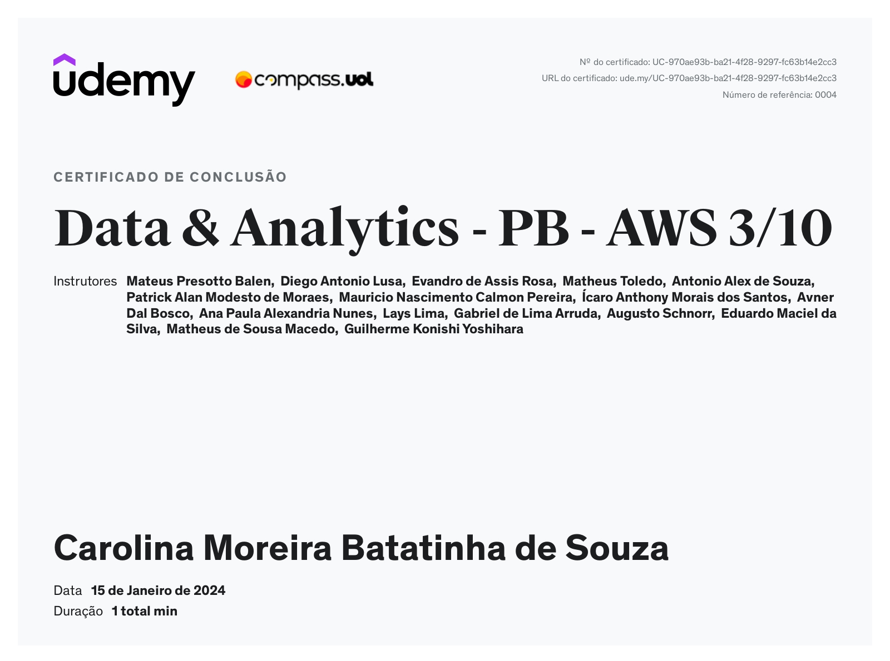

# Relatório da Sprint 3
A terceira sprint nos trouxe conhecimentos do básico ao avançado dentro do **Python**, incluindo seus fundamentos, estruturas de controle, manipulação de arquivos, funções, conceitos de Programação Orientada a Objetos, gerenciamento de pacotes, e isolamento de ambientes .

Para essa sprint, foram requeridas as resoluções dos exercícios e desafios propostos dentro da plataforma da Udemy. Os links das resoluções dos mesmos estão disponíveis na
seção **Exercícios** e **Desafio**.

# Exercícios  
### Seção 3
- [x] [Exercício 1](exercicios/secao_3/ex01.py)
- [x] [Exercício 2](exercicios/secao_3/ex02.py)
- [x] [Exercício 3](exercicios/secao_3/ex03.py)
- [x] [Exercício 4](exercicios/secao_3/ex04.py)
- [x] [Exercício 5](exercicios/secao_3/ex05.py)

### Seção 4 

- [x] [Exercício 6](exercicios/secao_4/ex06.py)
- [x] [Exercício 7](exercicios/secao_4/ex07.py)
- [x] [Exercício 8](exercicios/secao_4/ex08.py)
- [x] [Exercício 9](exercicios/secao_4/ex09.py)
- [x] [Exercício 10](exercicios/secao_4/ex10.py)
- [x] [Exercício 11](exercicios/secao_4/ex11.py)
- [x] [Exercício 12](exercicios/secao_4/ex12.py)
- [x] [Exercício 13](exercicios/secao_4/ex13.py)
- [x] [Exercício 14](exercicios/secao_4/ex14.py)
- [x] [Exercício 15](exercicios/secao_4/ex15.py)
- [x] [Exercício 16](exercicios/secao_4/ex16.py)
- [x] [Exercício 17](exercicios/secao_4/ex17.py)
- [x] [Exercício 18](exercicios/secao_4/ex18.py)
- [x] [Exercício 19](exercicios/secao_4/ex19.py)
- [x] [Exercício 20](exercicios/secao_4/ex20.py)
  
### Seção 6
- [x] [Exercício 21](exercicios/secao_6/ex21.py)
- [x] [Exercício 22](exercicios/secao_6/ex22.py)
- [x] [Exercício 23](exercicios/secao_6/ex23.py)
- [x] [Exercício 24](exercicios/secao_6/ex24.py)
- [x] [Exercício 25](exercicios/secao_6/ex25.py)

# Desafio

O desafio consiste na realização das atividades listadas no arquivo entitulado *[orientacoes.md](desafio/orientacoes.md)*. O arquivo *[actors.csv](desafio/actors.csv)* nos foi disponibilizado via download dentro da seção 7 da plataforma da Udemy. Para facilitar a compreensão da tarefa, as perguntas foram descritas e ordenadas antes de suas respectivas resoluções. O código respondido está disponível no arquivo *[main.py](desafio/main.py)*.

# Evidências

As evidências dessa sprint estão na seção **"Certificados"**

# Certificados

* "Data & Analytics - PB - AWS 3/10" 

