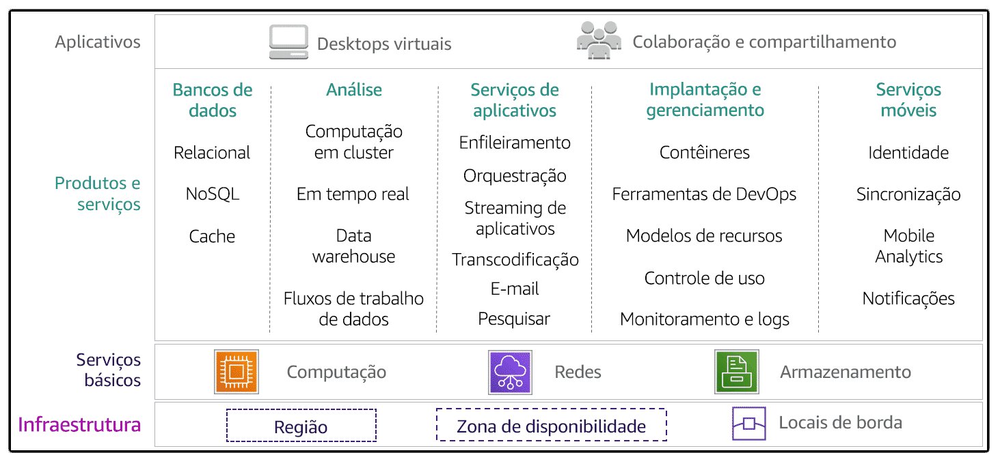
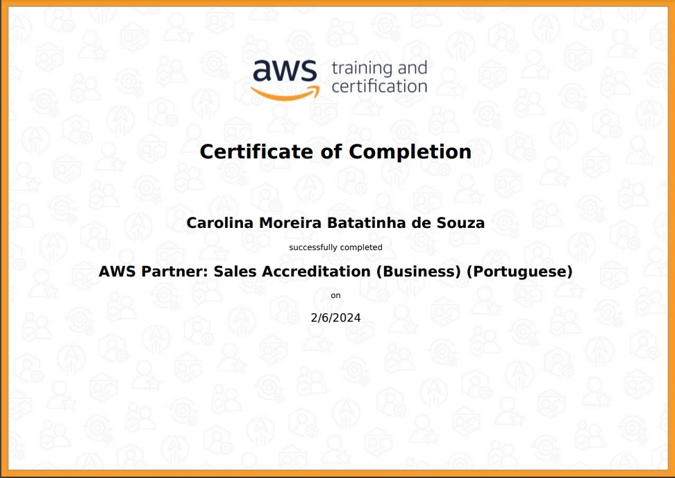
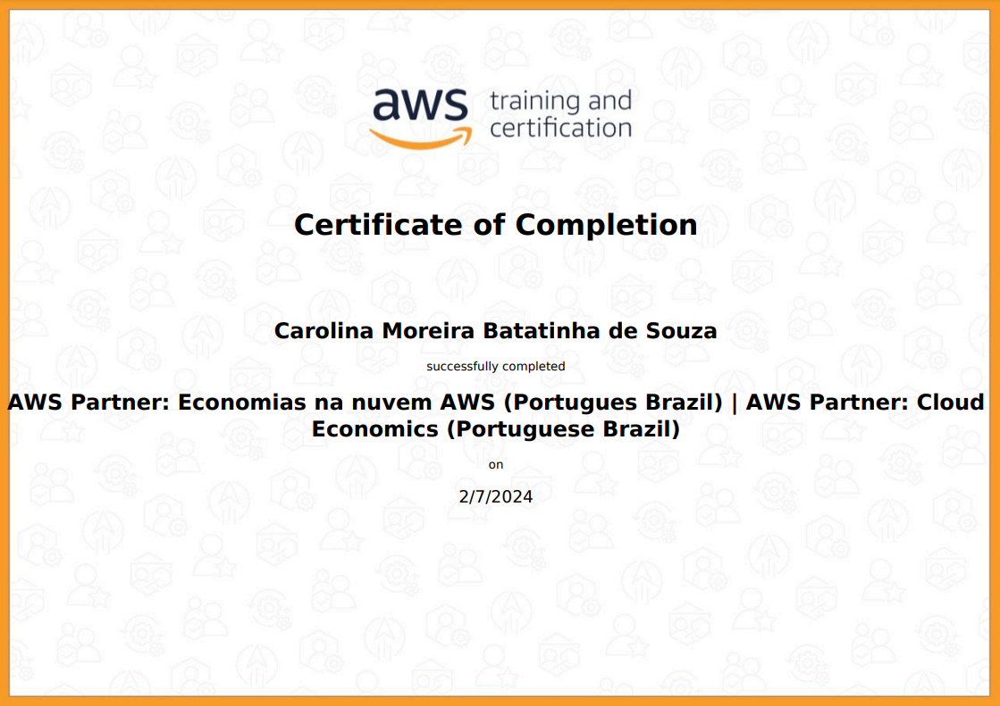
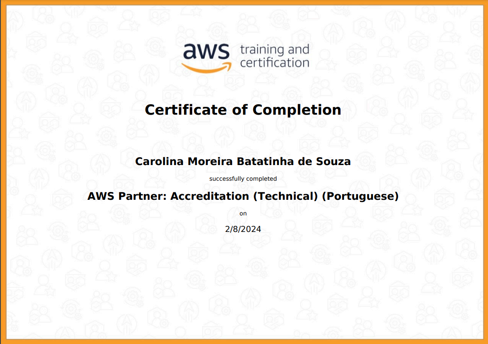
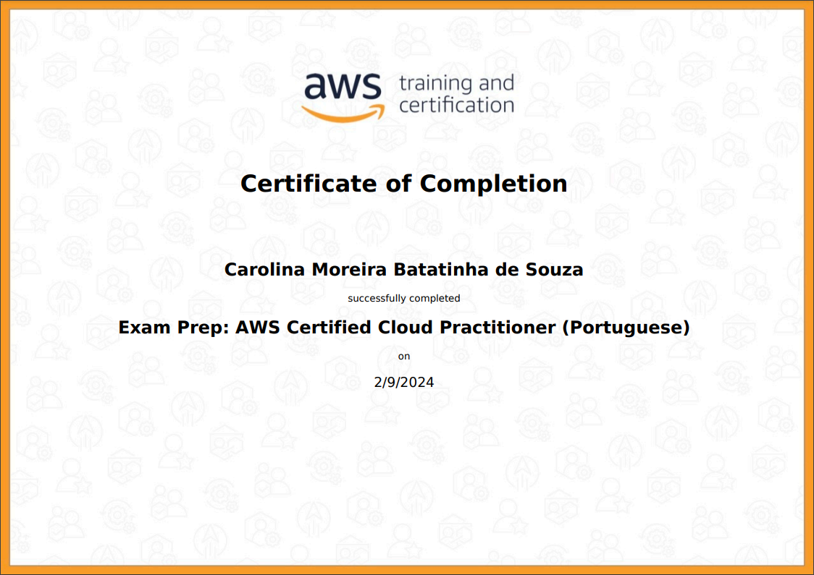

## 1 - **Sales Accreditation (Business)**

Neste curso, foram explorados os seguintes temas:

* Conceitos básicos dos serviços de nuvem;
* A proposta de valor da **AWS** aos clientes;
* Como lidar com as objeções dos clientes;
* Começar a vender com a **AWS**.

## 2 - **AWS Skill Build: Aspectos Econômicos na Nuvem**

Foram estudados a importância do valor comercial e do gerenciamento financeiro na nuvem para ajudar os clientes a perceberem os benefícios econômicos na nuvem **AWS**. Identificou-se os pilares do **Cloud Value Framework**, os conceitos principais do gerenciamento financeiro na nuvem e as práticas recomendadas. Analisou-se estudos de pesquisas que mostraram o valor comercial e os benefícios percebidos por clientes que migraram para a **AWS** e exemplos de clientes do mundo real.

### Aspectos econômicos na nuvem
A conversa e a análise do valor comercial ajudam você a abordar os componentes financeiros que normalmente são as principais preocupações dos clientes em potencial. A **AWS** desenvolveu o **Cloud Value Framework** como uma maneira de considerar o valor da nuvem. O *framework* é composto de cinco pilares: redução de custo, produtividade da equipe, resiliência operacional, agilidade empresarial e sustentabilidade. 

Normalmente, a redução de custos é o fator principal que motiva os clientes a migrarem para a nuvem. Embora o custo seja importante, os outros quatro pilares do *framework* promovem um valor comercial ainda maior e devem ser enfatizados nas conversas sobre valor comercial com o cliente.

### Redução de custos  

Uma ferramenta principal para informar sobre a redução de custos aos clientes é uma **análise de redução de custos**. Uma análise de redução de custos calcula o custo total de propriedade, que são os custos de aquisição e operacionais, para comparar a execução de um ambiente de TI tradicional completo on-premises com a implantação da **AWS**. 

Use uma análise de redução de custos para ajudar o cliente a comparar custos e criar um caso de negócio para fazer a transição para a **AWS**. Muitas vezes, o maior desafio para os clientes é compreender o verdadeiro escopo de seus custos atuais. Um caso de negócio ajuda os clientes a compararem os custos e a criarem um caso de negócio para migrarem para a nuvem.

### Produtividade da equipe

A produtividade da equipe se refere à eficiência adquirida com a redução ou a eliminação de tarefas não mais necessárias com os serviços de nuvem. O trabalho tático e indiferenciado necessário anteriormente nos data centers tradicionais, como aquisição, configuração e manutenção de hardware, não é mais necessário. Isso economiza tempo da equipe e reduz o tempo de inovação.

Com a **AWS**, os recursos dos clientes podem migrar para um trabalho mais estratégico. Eles adotam novos serviços e tecnologias, o que pode resultar em redução de custos adicionais e tempo de entrada no mercado acelerado. Os membros da equipe de TI que costumavam trabalhar em projetos, como implantações de ambientes de armazenamento e atualizações de servidores, podem fazer a transição para se tornarem especialistas em DevOps. Ao serem integrados à equipe de desenvolvimento, eles podem oferecer suporte ao desenvolvimento de novos produtos e serviços.

### Resiliência operacional

As organizações de TI com resiliência operacional dependem da integridade de quatro pilares: operações, segurança, software e infraestrutura. 

Para minimizar as interrupções operacionais e desastres, a **AWS** utiliza a automação, gerencia serviços de ponta a ponta, fornece visibilidade de todo o sistema, oferece suporte à configuração de segurança e governança dos recursos e monitora o acesso à **API**. Para reduzir os riscos de software, a **AWS** oferece implantações azuis/verdes, automatiza os fluxos de trabalho, executa implantações de códigos menores, fornece aplicações de patches ao sistema operacional e cria e gerencia os conjuntos de recursos da **AWS**.

A **AWS** ajuda a minimizar os riscos de segurança, fornece o **Identity and Access Management** e auxilia na conformidade. Para reduzir as falhas da infraestrutura, a **AWS** expande e melhora seus data centers, fornece várias zonas de disponibilidade e regiões, fornece sistemas altamente disponíveis e duráveis, oferece zonas de disponibilidade que se conectam de forma redundante e usa duas fontes de energia independentes para cada instância.

### Agilidade empresarial  
A agilidade empresarial significa entregar mais, por exemplo, responder mais rapidamente, fazer mais experiências e entregar resultados no mesmo tempo ou antes. Trata-se da habilidade de agregar mais valor aos clientes. Por exemplo, a agilidade empresarial pode promover o desenvolvimento de produtos, a expansão de novos mercados e a capacidade de resposta do stakeholder interno ou externo.

A agilidade empresarial é uma ampla área de valor que basicamente abre mais oportunidades para os clientes experimentarem e responderem com mais rapidez às mudanças das condições do negócio.  

### Sustentabilidade

Os clientes da **AWS** podem otimizar o consumo de recursos da **AWS** para obter reduções contínuas da pegada de carbono da carga de trabalho com coisas relativamente fáceis, por exemplo:

Usar o Programador de instâncias da **AWS** para desligar a computação quando não estiver em uso.
Escolher a tecnologia sem servidor quando possível.
Usar instâncias baseadas no **AWS Graviton**. O **Graviton** usa até 60% menos energia para obter o mesmo desempenho que as instâncias comparáveis do **Amazon EC2**.
Usar o **AWS Cost Explorer** para recomendações de dimensionamento correto das cargas de trabalho.

### Gerenciamento financeiro na nuvem  

O gerenciamento financeiro na nuvem inclui quatro áreas principais: 

* A medição e a responsabilidade focalizam o estabelecimento da transparência de custos e a responsabilidade por meio das etapas necessárias para garantir a visibilidade dos gastos.
* A otimização de custos focaliza a identificação de desperdícios, a criação de arquiteturas compatíveis com a nuvem que são dimensionadas com base na demanda e na melhoria da eficiência de custos.
* O planejamento e o forecast focalizam a obtenção de uma melhor compreensão dos custos associados às necessidades de TI atuais e futuras, o que promove planejamento financeiro e empresarial mais preciso.
* As operações financeiras na nuvem focalizam a identificação e o investimento em pessoas, processos, ferramentas e automação para oferecer suporte ao gerenciamento financeiro na nuvem.

### Avaliação do portfólio da migração (MPA)
A **MPA** ajuda os clientes a analisarem os dados sobre o inventário atual de TI *on-premise*s e a mapearem esses recursos para serviços da **AWS** para fazerem uma comparação de custos simples. Os clientes podem usar esses dados para validar seus casos de negócio e criar planos de migração.

Também podem usar esses dados para estimar o nível de trabalho e os custos associados à migração e para calcular as taxas de execução anuais dos recursos de computação e de armazenamento na **AWS**. Essas informações geralmente definem o conjunto de dados completo necessário para analisar e priorizar corretamente as migrações de aplicativos.

## 3 - Accreditation (Technical)

Os usuários da **AWS** podem criar e gerenciar recursos na plataforma de três formas. Todas as três opções são criadas em uma interface de programação de aplicativo (*API*) comum, semelhante ao *REST*, que serve como base da **AWS**. 

O **AWS Management Console** fornece uma interface gráfica avançada para a maioria dos recursos oferecidos pela **AWS**. Ele facilita o gerenciamento de nuvem de todos os aspectos da conta da **AWS** do cliente, incluindo o monitoramento dos gastos mensais por serviço, o gerenciamento de credenciais de segurança ou até mesmo a configuração de novos usuários do IAM.

A **AWS Command Line Interface** (*AWS CLI*) fornece um conjunto de utilitários que podem ser executados por meio de um programa de comando no Linux, Mac ou Windows. A **CLI** é uma ferramenta de código aberto que fornece comandos para interagir com os serviços da AWS.

Os **AWS** software development kits (*SDKs*) são pacotes que dão acesso à **AWS** em uma variedade de linguagens de programação populares. A **AWS** gerencia a infraestrutura como código usando os **SDKs** e as *APIs* subjacentes a eles. Esses **SDKs** específicos da linguagem contêm *APIs* com as quais os clientes podem incorporar a grande variedade de serviços de nuvem **AWS** em seu código sem escrever as funções por conta própria.

##### *Abrangência e especialização do serviço da AWS*

A **AWS** oferece um amplo conjunto de produtos e serviços baseados na nuvem, incluindo computação, armazenamento, bancos de dados, análises, redes, dispositivos móveis, ferramentas do desenvolvedor, ferramentas de gerenciamento, Internet das Coisas (IoT), segurança e aplicativos empresariais. Esses serviços ajudam as empresas a se moverem mais rapidamente, reduzirem custos de TI e ajustarem o dimensionamento. As maiores empresas e startups confiam na AWS como base para uma grande variedade de cargas de trabalho, como: aplicativos web e móveis, desenvolvimento de jogos, processamento de dados, data warehousing, armazenamento, arquivamento e muito mais.

## Certificados

[Link para o certificado do **AWS Skill Builder - AWS Cloud Quest: Cloud Practitioner** dentro do Credly](https://www.credly.com/earner/earned/badge/612a0ecd-3da8-4741-9ca4-a14c545a4ada)