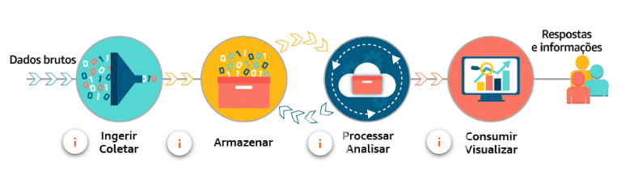

# Sprint 6 

# Data Analytics Fundamentals

**Avaliação** é um exame detalhado de algo para entender sua natureza ou determinar suas características essenciais. **Avaliação de dados** é o processo de compilar, processar e analisar dados para que você possa usá-los para tomar decisões.

**Análise** é a avaliação sistemática de dados. **Análise de dados** é o processo analítico específico sendo aplicado.

A **análise de dados** é vital para empresas de pequeno e grande porte. Os processos analíticos de dados são combinados para criar soluções de avaliação de dados, que ajudam as empresas a decidir onde e quando lançar novos produtos, quando oferecer descontos e quando comercializar em novas áreas. Sem os dados fornecidos por análise de dados, muitos responsáveis por tomar decisões se baseariam em intuição e pura sorte. 

Os dados são gerados de várias maneiras. A grande questão é onde colocar todos eles e como usá-los para extrair valor ou gerar vantagens competitivas. Os desafios identificados em muitas soluções de avaliação de dados podem ser resumidos por cinco desafios principais: **volume, velocidade, variedade, veracidade e valor**.

Uma solução de avaliação de dados tem muitos componentes. A análise realizada em cada um desses componentes pode exigir diferentes serviços e abordagens. Uma solução de avaliação de dados tem os seguintes componentes:  

## Volume: armazenamento de dados
Para mais anotações sobre **volume**, clique [aqui](data_analytics/volume.md)

## Velocidade: processamento de dados
Para mais anotações sobre **velocidade**, clique [aqui](data_analytics/velocidade.md)

## Variedade: estruturas e tipos de dados
Para mais anotações sobre **variedade**, clique [aqui](data_analytics/variedade.md)

## Veracidade: limpeza e transformação
Para mais anotações sobre **veracidade**, clique [aqui](data_analytics/veracidade.md)

## Valor: relatórios e business intelligence
Para mais anotações sobre **valor**, clique [aqui](data_analytics/valor.md)

# Introdução ao Amazon Kinesis Streams

**Amazon Kinesis** é uma família de serviços fornecidos pela Amazon Web Services (AWS) para processamento e análise de dados de streaming em tempo real em grande escala. Lançado em novembro de 2013, oferece aos desenvolvedores a capacidade de criar aplicativos que podem consumir e processar dados de diversas fontes simultaneamente. O **Kinesis** oferece suporte a vários casos de uso, incluindo análises em tempo real, coleta de dados de log e eventos e processamento em tempo real de dados gerados por dispositivos IoT.

O **Amazon Kinesis** é composto por quatro serviços principais: **Kinesis Data Streams**, **Kinesis Data Firehose**, **Kinesis Data Analytics** e **Kinesis Video Streams**.
Fluxos de dados do Kinesis

**Kinesis Data Streams** é um serviço de streaming de dados em tempo real escalonável e durável que captura e processa gigabytes de dados por segundo de diversas fontes. Ele permite o armazenamento e o processamento de dados em tempo real, tornando-o útil para aplicações que exigem insights imediatos, como monitoramento e alertas.

## Kinesis Data Firehose

**Kinesis Data Firehose** é um serviço totalmente gerenciado para entrega de dados de streaming em tempo real para destinos como **Amazon S3**, **Amazon Redshift**, **Amazon Elasticsearch** e armazenamentos de dados de parceiros da **AWS**. Com o **Data Firehose**, os usuários podem configurar e dimensionar a entrega de dados sem intervenção manual.

## Kinesis Data Analytics

O **Kinesis Data Analytics** permite a análise de dados de streaming em tempo real usando SQL padrão ou Apache Flink.

## Kinesis Video Streams

**Kinesis Video Streams** é um serviço totalmente gerenciado para captura, processamento e armazenamento seguro de streams de vídeo para análise e aprendizado de máquina. Ele oferece suporte a vários codecs de vídeo e protocolos de streaming, tornando-o adequado para vários casos de uso, como segurança e vigilância, dispositivos IoT habilitados para vídeo e transmissão de eventos ao vivo.
Integração

O **Amazon Kinesis** pode ser facilmente integrado a outros serviços da **AWS**, como **AWS Lambda**, **Amazon S3**, **Amazon Redshift** e **Amazon OpenSearch**. Essa integração permite que os desenvolvedores criem aplicativos completos de processamento de dados de streaming, aproveitando o extenso ecossistema da **AWS**.

### Casos de uso

Alguns casos de uso comuns do **Amazon Kinesis incluem**:

    - Análise em tempo real: análise de dados de streaming em tempo real para fornecer insights imediatos e tomar decisões baseadas em dados.
    - Coleta de dados de log e eventos: coleta, processamento e análise de dados de log e eventos gerados por aplicativos, infraestrutura e dispositivos.
    - Processamento de dados IoT: Processamento e análise de grandes volumes de dados gerados por dispositivos IoT em tempo real.
    - Aprendizado de máquina: ingestão e processamento de fluxos de vídeo para aplicativos de aprendizado de máquina, como reconhecimento de objetos, reconhecimento facial e análise de sentimentos.

## Amazon EMR

O **Amazon EMR** (anteriormente chamado de Amazon Elastic MapReduce) é uma plataforma de cluster gerenciada que simplifica a execução de estruturas de big data, como o **Apache Hadoop** e o **Apache Spark**, na **AWS** para processar e analisar grandes quantidades de dados. Ao usar essas estruturas e projetos de código aberto relacionados, é possível processar dados para finalidades analíticas e workloads de inteligência de negócios. O Amazon EMR também permite transformar e mover grandes quantidades de dados de e para outros armazenamentos de dados e bancos de dados da AWS, como o **Amazon Simple Storage Service** (*Amazon S3*) e o **Amazon DynamoDB**. 

## Amazon Athena

O **Amazon Athena** é um serviço de análise interativo e sem servidor criado em frameworks de código aberto, com suporte a formatos de tabela e arquivo abertos. O **Athena** fornece uma maneira simplificada e flexível de analisar petabytes de dados onde eles residem. Analise dados ou crie aplicações a partir de um data lake do **Amazon Simple Storage Service** (*S3*) e mais de 30 fontes de dados, incluindo fontes de dados on-premises ou outros sistemas em nuvem usando SQL ou Python. O Athena é construído com mecanismos Trino e Presto de código aberto e frameworks Apache Spark, sem necessidade de provisionamento ou configuração.

## Amazon QuickSight

O **Amazon QuickSight** (que é o serviço de análise de dados de negócios baseado na nuvem que facilita a criação de visualizações, a execução de análises ad-hoc e a rápida obtenção de informações empresariais a partir dos seus dados) permite que todos em sua organização entendam seus dados por meio de perguntas em linguagem natural, do uso de painéis interativos ou procurando automaticamente padrões e discrepâncias com tecnologia de *machine learning*.

## AWS IoT Analytics

O **AWS IoT Analytics** simplifica as etapas difíceis necessárias para analisar grandes volumes de dados de IoT, sem o custo e a complexidade de criar uma plataforma de análise de IoT. Os dados de IoT vêm de dispositivos que registram processos ruidosos (como temperatura, movimento ou som). Esses dados podem ter lacunas significativas, mensagens corrompidas ou leituras falsas, que precisam ser limpas antes da análise.

[O que é o AWS IoT Analytics?](https://docs.aws.amazon.com/pt_br/iotanalytics/latest/userguide/welcome.html)

## Amazon Redshift
O Amazon Redshift é um serviço de data warehousing totalmente gerenciado pela Amazon Web Services (AWS). Projetado para processar grandes volumes de dados e consultas complexas, o Redshift oferece um ambiente escalável e eficiente para análise de dados. Algumas características essenciais incluem:

1. Arquitetura Massivamente Paralela (MPP): O Redshift distribui dados e consultas em várias instâncias para processamento paralelo, proporcionando desempenho otimizado para cargas de trabalho analíticas.

2. Colunas de Armazenamento em Compressão: O armazenamento de dados é otimizado por meio da compressão em colunas, reduzindo os requisitos de armazenamento e melhorando a velocidade das consultas.

3. Backup Automático e Replicação: Oferece recursos automáticos de backup para garantir a segurança dos dados e permite a replicação para regiões diferentes, melhorando a resiliência e a recuperação de desastres.

4. Integração com Ferramentas de BI: O Redshift é compatível com várias ferramentas de Business Intelligence (BI) e análise de dados, facilitando a visualização e exploração de dados.

5. Escalabilidade Sob Demanda: Permite aumentar ou reduzir o número de nós conforme necessário para atender às demandas de processamento, proporcionando flexibilidade e controle de custos.

6. Segurança Avançada: Oferece recursos robustos de segurança, como criptografia de dados em repouso e em trânsito, integração com o AWS Identity and Access Management (IAM) e controle de acesso refinado.

7. SQL Nativo: Suporta consultas SQL padrão, facilitando a migração de cargas de trabalho existentes para o Redshift.

Essas características tornam o Amazon Redshift uma escolha popular para organizações que buscam uma solução eficiente e dimensionável para análise de dados e geração de relatórios.

## Serverless Analytics

O  termo "Serverless Analytics" da AWS refere-se a práticas e serviços que permitem análise de dados sem a necessidade de gerenciar servidores. A AWS oferece vários serviços que facilitam a construção de pipelines de dados e análises sem a complexidade de gerenciar infraestrutura. Abaixo, destaco alguns conceitos e serviços relacionados ao Serverless Analytics na AWS:

AWS Glue: É um serviço totalmente gerenciado que facilita a preparação e carregamento de dados para análise. Ele oferece a capacidade de descobrir, catalogar e transformar dados de forma automatizada, sem a necessidade de provisionar ou gerenciar servidores.

Amazon Athena: É um serviço de consulta interativa que permite analisar dados diretamente no Amazon S3 usando SQL padrão. Não é necessário provisionar ou gerenciar infraestrutura, tornando-o um serviço serverless para análise de dados.

Amazon QuickSight: É um serviço de visualização de dados que facilita a criação de dashboards interativos e relatórios. Pode ser integrado diretamente com outras soluções serverless da AWS, proporcionando uma experiência de análise sem a necessidade de gerenciar servidores.

AWS Step Functions: Permite criar fluxos de trabalho serverless para coordenar a execução de diversas etapas em uma aplicação. Pode ser utilizado para orquestrar tarefas relacionadas à análise de dados, como a execução de transformações no AWS Glue.

AWS Lambda: Embora não seja exclusivamente para analytics, o AWS Lambda é central para arquiteturas serverless. Pode ser usado para executar código em resposta a eventos, como a chegada de novos dados, tornando-o útil em pipelines de dados e processamento de eventos relacionados à análise.

Amazon Kinesis Data Analytics: Oferece a capacidade de processar e analisar dados em tempo real sem a necessidade de provisionar ou gerenciar servidores. Pode ser usado para análise em streaming, permitindo a extração de insights imediatos de dados em movimento.

Amazon Redshift Serverless: Este é um serviço de data warehousing que oferece análise escalável sem a necessidade de gerenciar a infraestrutura do cluster. Permite que você pague apenas pelo que consome, escalando automaticamente conforme necessário.

O Serverless Analytics na AWS proporciona flexibilidade, escalabilidade automática e redução da carga operacional, permitindo que as organizações se concentrem na análise de dados em vez de gerenciar infraestrutura. Recomenda-se sempre consultar a documentação mais recente da AWS para obter detalhes atualizados sobre os serviços e práticas associadas ao Serverless Analytics.