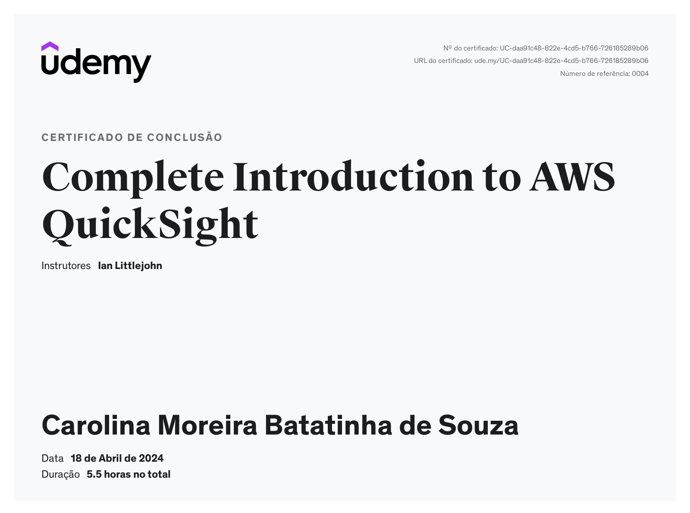

Nessa última sprint, estudamos os fundamentos do **Amazon QuickSight** no curso "***Complete Introduction to AWS QuickSight***", além de concluirmos o desafio 4, completando o desafio final.

## **Amazon QuickSight**

O ***Amazon QuickSight*** é introduzido como  um serviço de *business intelligence* (**BI**) da ***Amazon Web Services*** (**AWS**) que permite aos usuários criar, visualizar e compartilhar insights de dados de maneira rápida e fácil. Aqui está um resumo das principais características e funcionalidades:

1. **Conectividade de dados abrangente**: O ***QuickSight*** oferece suporte a uma ampla variedade de fontes de dados, incluindo bancos de dados na nuvem (como *Amazon Redshift*, *Amazon RDS*, *Amazon Aurora*) e locais (como *SQL Server*, *MySQL*, *PostgreSQL*), bem como serviços da **AWS** (como *Amazon S3*).

2. **Ferramentas de visualização intuitivas**: Com uma interface amigável e intuitiva, os usuários podem criar visualizações de dados facilmente, incluindo gráficos, tabelas, mapas e muito mais. O *QuickSight* oferece uma variedade de opções de personalização para atender às necessidades específicas de análise.

3. **Análise de autoatendimento**: Os usuários podem explorar os dados de forma independente, criar análises *ad-hoc* e responder a perguntas em tempo real usando recursos como filtros interativos, *drill-downs* e análises de séries temporais.

4. **Integração com serviços da AWS**: O *QuickSight* se integra perfeitamente com outros serviços da **AWS**, como *Amazon S3*, *Amazon Athena*, *Amazon Redshift*, *Amazon RDS*, entre outros, facilitando a análise de dados armazenados em diferentes serviços da **AWS**.

5. **Escalabilidade e desempenho**: Como um serviço totalmente gerenciado, o *QuickSight* oferece escalabilidade automática para lidar com conjuntos de dados de qualquer tamanho, além de oferecer alto desempenho para consultas e visualizações de dados.

6. **Segurança e conformidade**: O QuickSight adere aos padrões de segurança e conformidade da **AWS**, incluindo criptografia de dados em repouso e em trânsito, controle de acesso baseado em políticas e integração com serviços de autenticação existentes, como o *AWS Identity* and *Access Management* (**IAM**).

7. **Facilidade de compartilhamento e colaboração**: Os usuários podem compartilhar painéis e análises com colegas de equipe ou partes interessadas externas de forma fácil e segura, facilitando a colaboração e a tomada de decisões baseada em dados.

Resumindo, o **Amazon QuickSight** oferece uma solução completa e poderosa para análise de dados, permitindo que as organizações extraiam insights valiosos de seus dados de maneira rápida e eficiente.

## Desafio 4

O [desafio 4](desafio/analise_carolina.sou_2024-04-23T19_51_21.pdf) teve como objetivo analisar os dados dos **filmes** enquadrados no gênero **crime** que foram dirigidos por **Martin Scorsese** e estrelados por **Robert de Niro**, levando em consideração o ano de lançamento, o orçamento, a popularidade dos títulos, a  contagem dos votos e sua avaliação média dentro da **API** do **TMDB**, fazendo uso da ***AWS QuickSight***. Para tanto, foi requerido o consumo e a apresentação dos dados coletados a partir dos arquivos da pasta *Refined*, disponível no bucket desse desafio.

## **Desafio Final**

O [desafio final]() do Programa de Bolsas propôs para a Squad 2 uma análise dos dados de **filmes** ou séries enquadrados no gênero **crime**. Dentre as etapas percorridas, é possível mencionar o envio de arquivos .csv para o bucket destinado a armazenar os registros da tarefa, a aquisição de dados oriundos da API do site do [TMDB](https://www.themoviedb.org/?language=pt-BR), e sua passagem pelas pastas *Trusted* e *Refined*, a modelagem desses dados e, por fim, a visualização dos *insights* desses dados refinados.

## **Certificados**

* Complete Introduction to AWS QuickSight  

